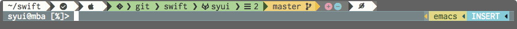

### powerline.zsh



- check icon turns (red) if the command fails

- ssh makes the bird (blue)

- `ctrl+e` emacs-mode (yellow)

- `ctrl+v` vi-mode(green), `Ctrl+a` normal-mode(red), `esc` insert-mode(cyan)

### use

```bash
$ git clone https://github.com/syui/ricomoon
$ mkdir -p ~/.local/share/fonts
$ cp ricomoon/ricomoon.ttf ~/.local/share/fonts

$ git clone https://github.com/syui/powerline.zsh
$ source !$:t/!$:t
```

### history


